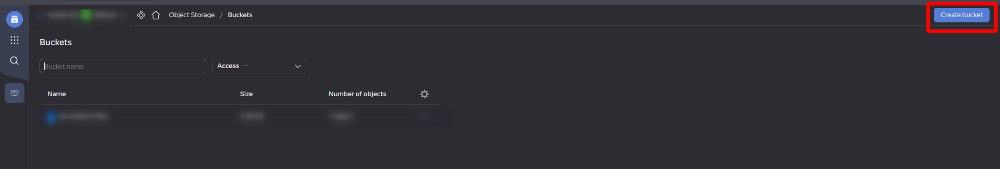

<div align="center">
  <h1>Currencies ETL using Yandex Cloud</h1>
</div>

<br />

## Table of Contents

- [About the Project](#about-the-project)
  * [About the Solution](#about-the-solution)
  * [Tech Stack](#tech-stack)
- [Getting Started](#getting-started)
  * [Prerequisites](#prerequisites)
  * [Installation](#installation)
  * [Postman collection](#postman-collection)
- [Usage](#usage)
  

## About the Project
Project provides endpoints to collect currency rates from CBR API to the Postgre database manually for given date and periodically every day for current date and returns currency rates from database for given date.

### About the Solution

There are three Cloud Functions were creted to solve this task:
- Initialize database - creates table in given Postgre database. 
- Import currencies - sends request to CBR API with given date to get currency rates and insert them in created table. This function is called periodically by Timer trigger.
- Get currencies - returns currencies for given date. 


### Tech Stack

<details>
  <summary>Yandex Cloud</summary>
  <ul>
    <li><a href="https://cloud.yandex.ru/services/functions/">Cloud Functions</a></li>
    <li><a href="https://cloud.yandex.ru/services/storage/">Object storage</a></li>
    <li><a href="https://cloud.yandex.ru/services/managed-postgresql/">Managed Service for PostgreSQL</a></li>
    <li><a href="https://cloud.yandex.ru/docs/functions/operations/trigger/timer-create/">Timer trigger</a></li>
  </ul>
</details>

<details>
<summary>Database</summary>
  <a href="https://www.postgresql.org/">PostgreSQL</a>
</details>


## Getting Started


### Prerequisites

1. Create Bucket in Yandex Cloud **Object Storage** with default settings.



2. To upload source code in the **Cloud Function** you need to make zip file with source code starting **bash** script: 

```bash
 make zip
```

 And upload zip file to the created **Bucket**.

3. To get Bearer Authorization token you need to install Yandex Cloud CLI ([Instruction](https://cloud.yandex.ru/docs/cli/quickstart#install)), create profile and create token:

```bash
yc iam create-token
```

This token is needed to call enpoints. Token expires in a year. 

4. Create Service account that will invoke functions.

### Installation

1. Create 3 Cloud Functions 


In the Editor select "Object storage" **Method**, specify **Bucket** and zip file name as **Object**. As **Entrypoint** set:
 - main.initialize_database_handler for Initialize database Function
 - main.import_currencies_handler for Import currencies Function
 - main.get_currencies_handler for Get currencies Function

For Initialize database Function create **Trigger** and set Timer setting "Cron expession" as **"0 9 ? * * *"**.

2. Set Environment Variables

`DB_HOST` - host to database

`DB_PORT` - port to database

`DB_USER` - database's user

`DB_PASSWORD` - user's password

`DB_NAME` - name of the database

`DB_TABLE` - name of table to create in database

These Environment Variables you should to add in "Environment Variables" in the Cloud Function Editor.


3. Select Service account.

4. Create version.

> There is **Link to invoke** for each Cloud Function. It's a endpoint to call. But it doesn't work without Bearer Token provided Yandex Cloud CLI.


### Postman collection

To call enpoints use **docs/ETL Yandex Cloud.postman_collection.json**


## Usage


First of all you need to create table in the database calling Initialize database Function with Authorization Bearer token in headers by **Link to invoke**.
After that you can collect currency rates from CBR API to your database calling Import currencies Function with Authorization token and also with date_req (required date) query string param in the "dd/mm/YYYY" (For, example: 11/11/2022) format (By default setted current date).
To get all currency rates for a needed date you should call the Get currencies Function with token and also with date_req query string param.

Example of Get currencies Function's response:

```json
{
    "data": [
        {
            "charCode": "USD",
            "dateReq": "2022-10-22",
            "id": "R01235",
            "name": "Доллар США",
            "nominal": 1,
            "numCode": 840,
            "value": "61.1958"
        },
        {
            "charCode": "EUR",
            "dateReq": "2022-10-22",
            "id": "R01239",
            "name": "Евро",
            "nominal": 1,
            "numCode": 978,
            "value": "59.8378"
        }
    ]
}
```